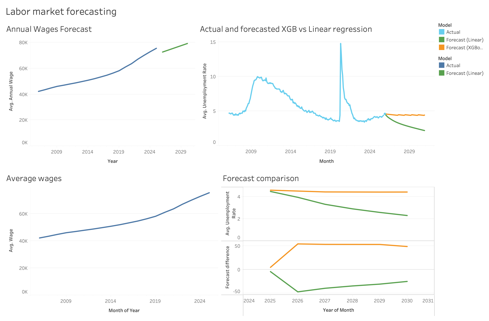

# Labor Market Forecasting Project

This project constructs a labor market forecasting pipeline that models and visualizes:
- U.S. unemployment rates (historical + 5 year forecasts)
- Average annual wages (historical + 5-year forecast)
- Model comparisons between **Linear Regression** and **XGBoost** 
- An interactive **Tableau dashboard** for exploration and visualization

---

## Project Overview and Objectives

1. Ingest and store labor market data using a relational database (SQLite)
2. Engineer and transform to time-based features for forecasting and modeling
3. Forecast:
   - Monthly unemployment rates (Linear Regression & XGBoost 5 year horizon)
   - Annual wages (Linear Regression, 5 year horizon)
4. Compare forecast behavior across models
5. Visualize results in Tableau with a polished dashboard

---
## Data Pipeline Overview
### Data Sources
- FRED (Federal Reserve Economic Data) for unemployment and wage indicators

### Storage
- All raw and derived data are stored in SQLite
- Database file: `src/db/jobmarket.db`

### ETL
- Data extraction and loading handled in `src/etl/`
- SQL scripts materialize clean tables for modeling and visualization

## Dashboard Insights & Findings

### Unemployment

The **Actual vs Forecasted Unemployment** panel highlights two major structural shocks in the labor market:

- **Great Recession (2008–2010)**  
  Unemployment rises sharply to around 10%, followed by a long, gradual recovery.

- **COVID-19 Shock (2020)**  
  A sudden spike to nearly **11%**, followed by a very fast recovery.

These events directly impact model behavior and forecast reliability.

---

### Forecast Model Behavior: Linear vs XGBoost

#### Linear Regression Forecast
- Predicts a **steady decline** in unemployment over the next five years   
- Produces a more **optimistic outlook**  
- Highly sensitive to recent downward momentum  

---

#### XGBoost Forecast
- Produces a **flatter, more conservative** unemployment path    
- Better captures **nonlinear behavior and regime changes**

**Interpretation:**  
XGBoost implicitly assumes that post-shock normalization leads to stabilization rather than continuous improvement.

---

### Forecast Comparison Panel: Model Divergence

The **Forecast Comparison** chart makes model differences explicit:

- The **gap between Linear and XGBoost widens over time**
- XGBoost stabilizes unemployment closer to current levels

> Different models answer different “what-if” questions about the future.

---

### Annual Wages: Persistent Long-Run Growth

The **Average Wages** panel shows:

- A consistent upward trend from ~2006 onward  
- Temporary slowdowns but **no structural wage collapse**, even during COVID  
- Accelerated wage growth post-2020  

This indicates that wages are more resilient than unemployment during downturns.

---

###  Annual Wage Forecast: Structural Implication

The 5-year annual wage forecast (Linear Regression) suggests:

- Continued wage growth despite:
  - Stabilizing unemployment
  - Reduced labor market slack

